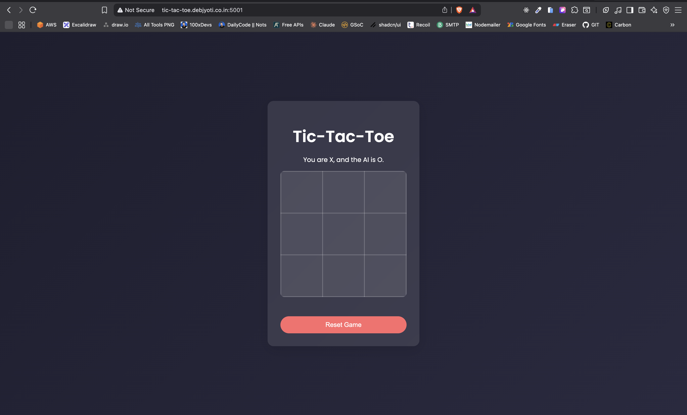
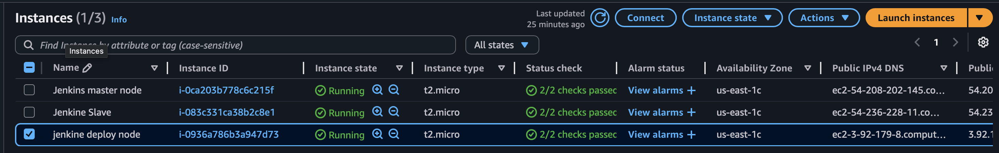
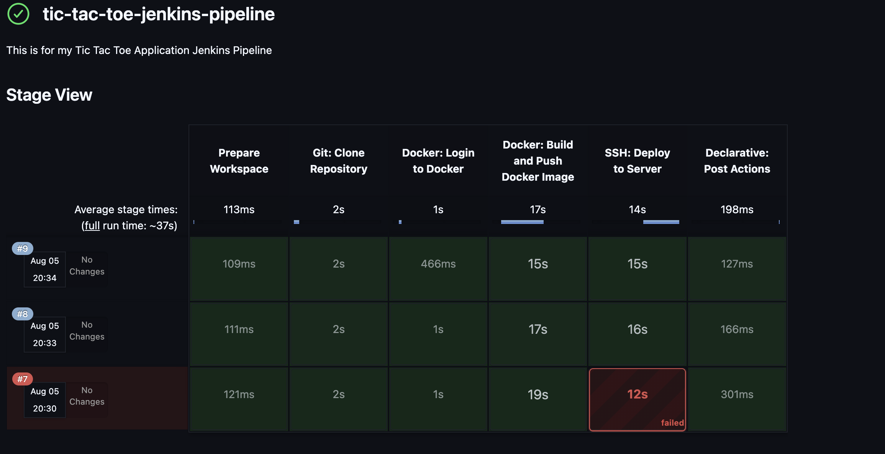
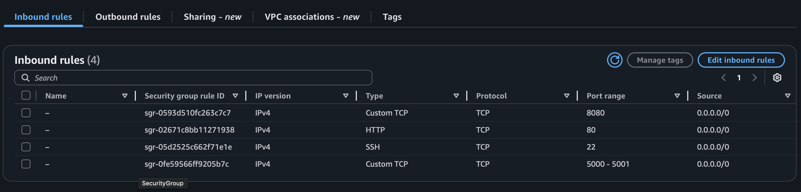
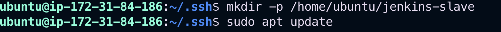
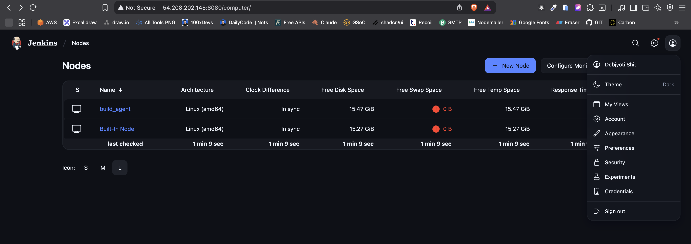
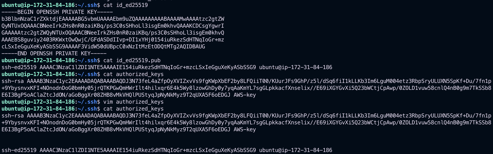
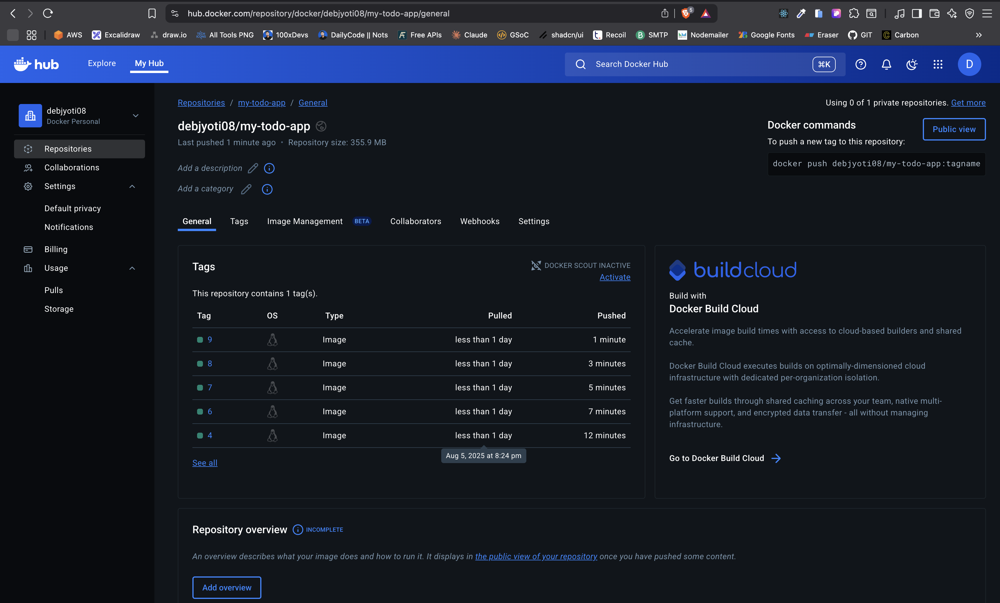
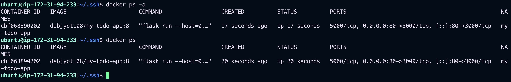
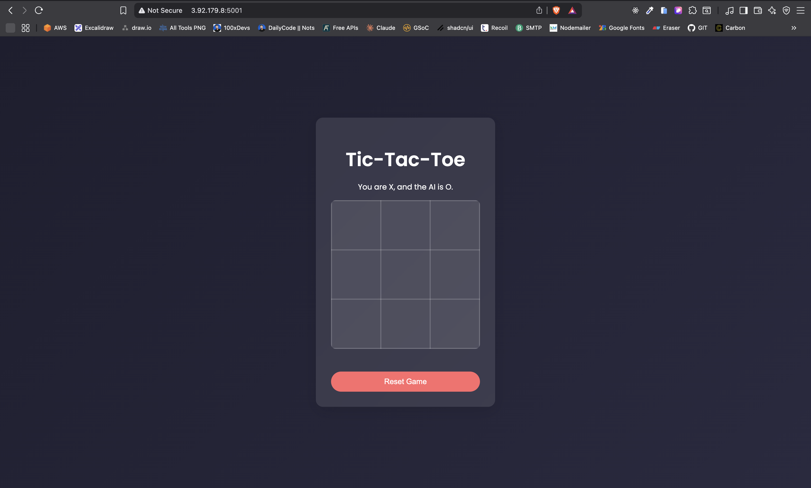

# Distributed Jenkins CI/CD Pipeline on AWS

This project demonstrates a complete Continuous Integration and Continuous Deployment (CI/CD) pipeline using a distributed Jenkins architecture. It showcases how to efficiently manage resources, even with limited hardware like AWS `t2.micro` instances, by separating concerns across multiple servers.

The pipeline automatically builds a Dockerized application, pushes the image to Docker Hub, and deploys it to a dedicated server, all triggered by a push to a Git repository.

## Architecture: A Resource-Efficient 3-Tier Approach

To optimize performance and avoid overloading any single machine, we use a distributed setup with three distinct roles, all running on cost-effective AWS `t2.micro` instances:

1.  **Jenkins Master Node:** The central brain of the operation. It hosts the Jenkins UI, manages jobs, and delegates tasks. It does not perform any heavy lifting, keeping it lightweight and responsive.
2.  **Jenkins Agent (Build) Node:** The workhorse. This server is responsible for resource-intensive tasks like cloning the repository, running tests, and executing `docker build` and `docker push` commands.
3.  **Deployment Target Node:** The production stage. This server's sole purpose is to run the final application container (`docker run`), serving it to end-users. It is completely decoupled from the build process.

## Home Page 


## All The VM


## Stage View


## Features

- **Distributed Builds:** Leverages a master/agent architecture to prevent resource bottlenecks.
- **Declarative Pipeline:** The entire CI/CD process is defined as code in a `Jenkinsfile`.
- **Dockerization:** The application is containerized for consistent environments from development to production.
- **Automated Deployment:** Securely deploys the application to a target server using SSH with private keys.
- **Credential Management:** Securely handles Docker Hub and SSH credentials using Jenkins' built-in manager.
- **Resource Efficiency:** Specifically designed to run smoothly on a minimal-cost AWS `t2.micro` setup.

## Setup Instructions

### Step 1: Provision EC2 Instances & Key Pair

1. Launch three AWS EC2 t2.micro instances with an Ubuntu Server AMI, naming them `jenkins-master`, `jenkins-agent`, and `deployment-target`. (You can use different names if you want.)
   

2. When launching, create one SSH key pair for all three instances. Download and save the `.pem` file.

3. Confirm all three instances are running.

### Step 2: Configure Security Group

Create a single Security Group and attach it to all three instances with the following inbound rules to allow necessary traffic:


### Step 3: Server Provisioning with Scripts

SSH into each server to run the appropriate installation scripts. The scripts can be found in the `/scripts` folder of this repository.

### On the jenkins-master Node:

1. Execute the `jenkins.sh` script to set up the Jenkins Master.

### On the jenkins-agent and deployment-target Nodes:

1. Execute the `docker.sh` script to install Docker.

2. Install Java on the jenkins-agent node:

```sh
sudo apt update
sudo apt install -y openjdk-17-jdk
```

After the script finishes, run the following command to allow Docker usage without `sudo`. You may need to log out and log back in for this to take effect:

```sh
sudo usermod -aG docker $USER && newgrp docker
```

### Step 4: Jenkins Configuration

### 1. Initial Setup

- Access the Jenkins UI at `http://<your-master-ip>:8080`
- Get the initial admin password:
  ```sh
  sudo cat /var/lib/jenkins/secrets/initialAdminPassword
  ```
- Install the "suggested plugins".

### 2. Add Credentials

- Navigate to **Manage Jenkins > Credentials**
- Add credentials for Docker Hub and SSH as shown below:
  

### 3. Configure the Build Agent

- Go to **Manage Jenkins > Nodes > New Node**
- Configure the agent and make sure the Remote root directory is set properly.

### Create the root directory


After saving, the Master will connect to the agent. A successful connection will show the agent as *idle* and ready.


### Set up the public/private SSH keys on jenkins-agent and deployment-target


## Pipeline in Action

### Jenkins Stage View

Once the pipeline runs, you’ll see progress for each stage:


### Docker Hub

The Build & Push stage pushes the Docker image to your Docker Hub repository:


### Test on deployment-target instance

You can verify if the Docker container is running on the deployment-target:


## Application Deployment

Before deployment, accessing the server IP shows nothing:

After a successful pipeline run, the application becomes live:


### Now with Domain Name

The app is now accessible via a domain:

